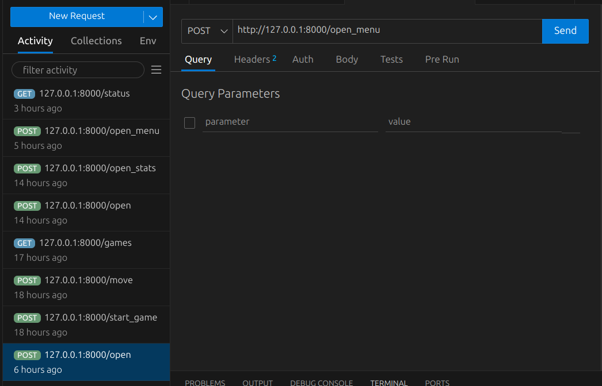
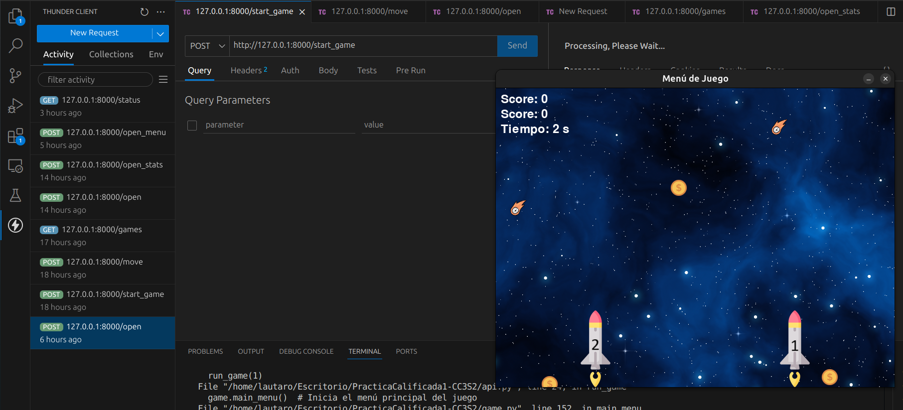

# Documentacion

# Reglas del juego
- El juego está diseñado para 2 jugadores.
- El juego genera monedas, donde cada moneda aumenta el score del jugador en 20 puntos.
- El juego genera meteoritos. Si la nave se estrella contra un meteorito, perderá una vida y cuando se terminen las vidas de la nave, esta se destruirá.
- Cada jugador tiene 3 vidas.
- Gana el jugador que llegue primero a los 100 puntos o el que tenga más score al final del juego.

# API REST - Juego de Naves Espaciales

Esta API está diseñada para gestionar un juego de naves espaciales, donde los jugadores compiten para llegar a la meta evitando obstáculos. Se pueden realizar movimientos de las naves, consultar el estado del juego, y almacenar estadísticas y resultados de las partidas. Además, la API está instrumentada con Prometheus para monitorear métricas, como la velocidad de las naves y las colisiones.

## Base URL
\`\`\`
http://127.0.0.1:8000
\`\`\`

---

## Endpoints

### 1. Abrir el menú principal

**Descripción**: Inicia el menú principal del juego.

- **URL**: `/open_menu`
- **Método**: `POST`
- **Respuesta**:
  - `200 OK`: `{"message": "Menu Abierto"}`

---

### 2. Mover la nave

**Descripción**: Mueve la nave del jugador en la dirección especificada.

- **URL**: `/move`
- **Método**: `POST`
- **Cuerpo**:
  \`\`\`json
  {
    "player": 1, 
    "direction": "left"  // o "right"
  }
  \`\`\`
- **Respuesta**:
  - `200 OK`: `{"message": "Movimiento realizado"}`
  - `400 Bad Request`: `"Jugador inválido"`

---

### 3. Consultar estado del jugador

**Descripción**: Obtiene la posición y el número de colisiones del jugador.

- **URL**: `/status`
- **Método**: `GET`
- **Parámetro de consulta**: `player` (número de jugador)
- **Respuesta**:
  - `200 OK`: 
    \`\`\`json
    {
      "player": 1,
      "position": 150,
      "collisions": 3
    }
    \`\`\`
  - `400 Bad Request`: `"Jugador inválido"`

---

### 4. Guardar estadísticas del juego

**Descripción**: Guarda las estadísticas de una partida finalizada.

- **URL**: `/stats`
- **Método**: `POST`
- **Cuerpo**:
  \`\`\`json
  {
    "player1_collisions": 3,
    "player2_collisions": 2,
    "winner": "player1",
    "score_player1": 100,
    "score_player2": 80
  }
  \`\`\`
- **Respuesta**:
  - `200 OK`: 
    \`\`\`json
    {
      "player1_collisions": 3,
      "player2_collisions": 2,
      "winner": "player1",
      "score_player1": 100,
      "score_player2": 80
    }
    \`\`\`

---

### 5. Obtener todas las partidas almacenadas

**Descripción**: Devuelve la lista de todas las partidas almacenadas.

- **URL**: `/games`
- **Método**: `GET`
- **Respuesta**:
  - `200 OK`: 
    \`\`\`json
    [
      {
        "player1_score": 300,
        "player2_score": 250,
        "winner": "player1"
      },
      {
        "player1_score": 180,
        "player2_score": 220,
        "winner": "player2"
      }
    ]
    \`\`\`

---

### 6. Obtener posiciones de los jugadores

**Descripción**: Obtiene las posiciones actuales de ambos jugadores en el juego.

- **URL**: `/positions`
- **Método**: `GET`
- **Respuesta**:
  - `200 OK`: 
    \`\`\`json
    {
      "player1 position": 150,
      "player2 position": 200
    }
    \`\`\`

---

### 7. Cerrar el juego

**Descripción**: Cierra el juego y libera los recursos de `pygame`.

- **URL**: `/close`
- **Método**: `POST`
- **Respuesta**:
  - `200 OK`: `{"message": "Juego cerrado exitosamente"}`
  - `400 Bad Request`: `"El juego no está iniciado"`

---

# ¿Cómo Jugar?

### Paso 1: Clonar el repositorio
1. Abre una terminal en tu computadora.
2. Usa el siguiente comando para clonar el repositorio del proyecto:
   ```bash
   git clone https://github.com/lautaroballesteros0926/PracticaCalificada1-CC3S2.git
   ```

3. Una vez clonado, navega dentro de la carpeta del proyecto:
   ```bash
   cd nombre_del_repositorio
   ```

### Paso 2: Crear un entorno virtual
1. Crea un entorno virtual en el directorio del proyecto. Esto aísla las dependencias del proyecto:
   ```bash
   python -m venv env
   ```

2. Activa el entorno virtual:
   - **En Windows**:
     ```bash
     .\env\Scripts\activate
     ```
   - **En macOS/Linux**:
     ```bash
     source env/bin/activate
     ```

3. Instala las dependencias necesarias que están listadas en el archivo `requirements.txt`:
   ```bash
   pip install -r requirements.txt
   ```

### Paso 3: Ejecutar la API
1. Con el entorno virtual activado, ejecuta la API con el siguiente comando:
   ```bash
   uvicorn api:app --reload
   ```

2. Verás un mensaje indicando que la API está corriendo en:
   ```
   http://127.0.0.1:8000
   ```

   Puedes colocar ´http://127.0.0.1:8000/docs´ para interactuar con la API o usar herramientas como Thunder Client para probar las solicitudes.

### Paso 4: Probar la API con Thunder Client
Usaremos la extensión **Thunder Client** de Visual Studio Code para interactuar con la API.

1. Abre **Thunder Client** en Visual Studio Code y crea una nueva solicitud POST.
2. Usa la siguiente URL para abrir el menú principal del juego:
   ```
   http://127.0.0.1:8000/open_menu
   ```


### Mover las Naves
Para mover las naves, haz una solicitud POST a la API con los siguientes parámetros:

- **URL**:
  ```
  http://127.0.0.1:8000/move
  ```

- **Cuerpo de la solicitud (JSON)**:
  ```json
  {
    "player": 1,
    "direction": "left"  // o "right"
  }
  ```

Esto moverá la nave del jugador 1 en la dirección especificada. Si deseas mover la nave del jugador 2, reemplaza `"player": 1` con `"player": 2`.

Instamos en utilizar la interfaz grafica para una mejor desenvolvimiento en el juego. 
### Controles de Teclado
También puedes mover las naves en la interfaz gráfica del juego usando las teclas del teclado:

- **Nave 1**: Usa las teclas `A` para moverte a la izquierda y `D` para moverte a la derecha.
- **Nave 2**: Usa las flechas de dirección: `←` para la izquierda y `→` para la derecha.

### Reiniciar el Juego
Para reiniciar el juego, simplemente envía otra solicitud POST a:
```
http://127.0.0.1:8000/open_menu
```

### Explorar más funcionalidades
Además de abrir el menú y mover las naves, puedes consultar estadísticas o cerrar el juego con las siguientes rutas de la API:

- **Ver estadísticas**: 
  ```
  http://127.0.0.1:8000/open_stats
  ```

- **Cerrar el juego**: 
  ```
  http://127.0.0.1:8000/close
  ```


## Practica Calificada 1 

### Control de naves espaciales con la API (3 puntos) 

Para esta seccion controlaremos las naves a traves de la API creada, utilizaremos thunder Client para hacer nuestras requests, esta es una extension de Vscode. 

creamos la API: 


Iniciando el juego a traves de la API: 


Abrimos el menu: 


Iniciamos el juego: 




