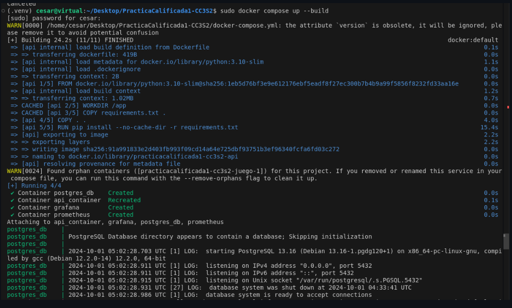

# Documentacion


# Reglas del juego
- El juego está diseñado para 2 jugadores.
- El juego genera monedas, donde cada moneda aumenta el score del jugador en 20 puntos.
- El juego genera meteoritos. Si la nave se estrella contra un meteorito, perderá una vida y cuando se terminen las vidas de la nave, esta se destruirá.
- Cada jugador tiene 3 vidas.
- Gana el jugador que llegue primero a los 100 puntos o el que tenga más score al final del juego.

# API REST - Juego de Naves Espaciales

Esta API está diseñada para gestionar un juego de naves espaciales, donde los jugadores compiten para llegar a la meta evitando obstáculos. Se pueden realizar movimientos de las naves, consultar el estado del juego, y almacenar estadísticas y resultados de las partidas. Además, la API está instrumentada con Prometheus para monitorear métricas, como la velocidad de las naves y las colisiones.

## Base URL

`http://127.0.0.1:8000`

---

## Endpoints

### 1. Abrir el menú principal

**Descripción**: Inicia el menú principal del juego.

- **URL**: `/open_menu`
- **Método**: `POST`
- **Respuesta**:
  - `200 OK`: `{"message": "Menu Abierto"}`

---

### 2. Mover la nave

**Descripción**: Mueve la nave del jugador en la dirección especificada.

- **URL**: `/move`
- **Método**: `POST`
- **Cuerpo**:
  ```json
  {
    "player": 1, 
    "direction": "left"  // o "right"
  }
  ```
- **Respuesta**:
  - `200 OK`: `{"message": "Movimiento realizado"}`
  - `400 Bad Request`: `"Jugador inválido"`

---

### 3. Consultar estado del jugador

**Descripción**: Obtiene la posición y el número de colisiones del jugador.

- **URL**: `/status`
- **Método**: `GET`
- **Parámetro de consulta**: `player` (número de jugador)
- **Respuesta**:
  - `200 OK`: 
    ```json
    {
      "player": 1,
      "position": 150,
      "collisions": 3
    }
    ```
  - `400 Bad Request`: `"Jugador inválido"`

---

### 4. Guardar estadísticas del juego

**Descripción**: Guarda las estadísticas de una partida finalizada.

- **URL**: `/stats`
- **Método**: `POST`
- **Cuerpo**:
  ```json
  {
    "player1_collisions": 3,
    "player2_collisions": 2,
    "winner": "player1",
    "score_player1": 100,
    "score_player2": 80
  }

- **Respuesta**:
  - `200 OK`: 
    ```json
    {
      "player1_collisions": 3,
      "player2_collisions": 2,
      "winner": "player1",
      "score_player1": 100,
      "score_player2": 80
    }
    

---

### 5. Obtener todas las partidas almacenadas

**Descripción**: Devuelve la lista de todas las partidas almacenadas.

- **URL**: `/games`
- **Método**: `GET`
- **Respuesta**:
  - `200 OK`: 
    ```json
    [
      {
        "id": 1,
        "player1_collisions": 5,
        "player2_collisions": 3,
        "winner": "player1",
        "score_player1": 150,
        "score_player2": 100
      },
      {
        "id": 2,
        "player1_collisions": 2,
        "player2_collisions": 4,
        "winner": "player2",
        "score_player1": 200,
        "score_player2": 250
      }
    ]
    

---

### 6. Obtener posiciones de los jugadores

**Descripción**: Obtiene las posiciones actuales de ambos jugadores en el juego.

- **URL**: `/positions`
- **Método**: `GET`
- **Respuesta**:
  - `200 OK`: 
    ```json
    {
      "player1 position": 150,
      "player2 position": 200
    }
    

---

# ¿Cómo Jugar?

### Paso 1: Clonar el repositorio
1. Abre una terminal en tu computadora.
2. Usa el siguiente comando para clonar el repositorio del proyecto:
   ```bash
   git clone https://github.com/lautaroballesteros0926/PracticaCalificada1-CC3S2.git
   ```

3. Una vez clonado, navega dentro de la carpeta del proyecto:
   ```bash
   cd nombre_del_repositorio
   ```

### Paso 2: Crear un entorno virtual
1. Crea un entorno virtual en el directorio del proyecto. Esto aísla las dependencias del proyecto:
   ```bash
   python -m venv env
   ```

2. Activa el entorno virtual:
   - **En Windows**:
     ```bash
     .\env\Scripts\activate
     ```
   - **En macOS/Linux**:
     ```bash
     source env/bin/activate
     ```

3. Instala las dependencias necesarias que están listadas en el archivo `requirements.txt`:
   ```bash
   pip install -r requirements.txt
   ```
### Paso 3: Tener PostgreSQL instalado 
1. Para este punto es sumamente necesario tene instalado PostgreSQL y tener creada la base de datos ya que sin ello no podremos guardar las partidas jugadas. A continuacion una guia rápida para poder tener todo en orden: 
  ```bash
   sudo apt update
   ```
   ```bash
   sudo apt install postgresql postgresql-contrib
   ```

2. En este punto crearemos una constraseña para nuestro usuario postgres, entramos a PostgreSQL: 
  ```bash
   sudo -u postgres psql
   ```
   ```bash
   \password postgres
   ```
  Colocamos una contraseña para usuario postgres, en nuestro caso escogimos la contraseña `postgres`. Tu podrias escoger la que desees pero tendrias que hacer un cambio en la clase `database.py` ya que es aqui donde se hace la conexion a nuestra base de datos. Observar que tenemos que cambiar la variable 'contraseña'. 

  

3. Ya como paso final debemos crear la base de datos cuyo nombre es `pygame`. Para esto nos dirigimos a la consola de PostgreSQL. 

  ```bash
   sudo -u postgres psql
  ```
  Desde la consola de postgres, escribimos: 

   ```bash
   CREATE DATABASE pygame; 
   ```
  Veremos un mensaje que se creo nuestra base de de datos. Recuerda que puedes cambiar y ponerle el nombre que quieras pero tendrias que hacer cambios en `database.py`. Como se mostro en la imagen anterior. 

  Listo, ! ya tendriamos todo para estar listo para jugar ! o al menos por ahora. 

### Paso 4: Ejecutar la API
1. Con el entorno virtual activado, ejecuta la API con el siguiente comando:
   ```bash
   uvicorn api:app --reload
   ```

2. Verás un mensaje indicando que la API está corriendo en:
   ```
   http://127.0.0.1:8000
   ```

   Puedes colocar ´http://127.0.0.1:8000/docs´ en tu navegador para interactuar con la API o usar herramientas como Thunder Client para probar las solicitudes.

### Paso 4: Probar la API con Thunder Client
Usaremos la extensión **Thunder Client** de Visual Studio Code para interactuar con la API.

1. Abre **Thunder Client** en Visual Studio Code y crea una nueva solicitud POST.
2. Usa la siguiente URL para abrir el menú principal del juego:
   ```
   http://127.0.0.1:8000/open_menu
   ```


Le damos a 'send' y la magia comienza: 


En este punto solo es necesario darle click al boton de start y comenzar a jugar. 

### Mover las Naves
Para mover las naves, haz una solicitud POST a la API con los siguientes parámetros:

- **URL**:
  ```
  http://127.0.0.1:8000/move
  ```

- **Cuerpo de la solicitud (JSON)**:
  ```json
  {
    "player": 1,
    "direction": "left"  // o "right"
  }
  ```

Esto moverá la nave del jugador 1 en la dirección especificada. Si deseas mover la nave del jugador 2, reemplaza `"player": 1` con `"player": 2`.

Instamos en utilizar la interfaz grafica para una mejor desenvolvimiento en el juego. 

### Controles de Teclado
También puedes mover las naves en la interfaz gráfica del juego usando las teclas del teclado:

- **Nave 1**: Usa las teclas `A` para moverte a la izquierda y `D` para moverte a la derecha.
- **Nave 2**: Usa las flechas de dirección: `←` para la izquierda y `→` para la derecha.


### Reiniciar el Juego
Para reiniciar el juego, simplemente envía otra solicitud POST a:

```
http://127.0.0.1:8000/open_menu
```

o en su defecto en la pantalla de finalizacion, dale click al boton de apagado y volveras al menu principal. 


### Paso 5 (Opcional): 
En este punto desarrollamos una interfaz por comando en donde internamente se hacen las requests. Para probarla solo tienes que seguir los siguientes pasos: 

1. Ejecuta la API con el siguiente comando:
   ```bash
   uvicorn api:app --reload
   ```
2. En otra terminal entra al directorio del proyecto donde tienes guardado y ejecuta el siguiente comando: 

   ```bash
   python interfaz.py 
   ```


## Practica Calificada 1 

### Control de naves espaciales con la API (3 puntos) 

El objetivo ya esta realizado, dejaremos como envidencia el control y monitoreo de las naves a traves de nuestra API. Para esta seccion controlaremos las naves a traves de la API creada, utilizaremos thunder Client para hacer nuestras requests, esta es una extension de Vscode. 

1. Ejecuta la API con el siguiente comando:
   ```bash
   uvicorn api:app --reload
   ```


Utilizaremos la extension de thunder Client para hacer las requests a nuestra API, observe: 

2. Usa la siguiente URL para abrir el menú principal del juego:
   ```
   http://127.0.0.1:8000/open_menu
   ```


Le damos a 'send' : 


Podemos mover la nave a traves de una solictud post de la siguiente manera: 


Vemos como respuesta de la solicitudo post, recordemos: 

**Descripción**: Mueve la nave del jugador en la dirección especificada.

- **URL**: `/move`
- **Método**: `POST`
- **Cuerpo**:
  ```json
  {
    "player": 1, 
    "direction": "left"  // o "right"
  }
  ```
- **Respuesta**:
  - `200 OK`: `{"message": "Movimiento realizado"}`
  - `400 Bad Request`: `"Jugador inválido"`

Como evidenciamos la respuesta : 


Esto demuestra que el objetivo para esta pregunta ha sido cumplido. Tomar en cuenta la documentacion de los endpoints que sirve como guia para interactuar con nuestra API.

### Monitorización del rendimiento de las naves (2 puntos)
Para la monitorizacion de los eventos que suceden durante la partida hemos usado prometheus y grafana lo cual explicaremos como lo hemos implementado y como se veria el resultado.
1. Primero creamos los contenedores en el archivo docker-compose.yml de prometheus y grafana en los puertos 9090 y 3000 respectivamente:
   
   

2. Luego procedemos a configurar el Prometheus en el archivo prometheus.yml señalando que prometheus debe recolectar la informacion de las metricas de "/metrics":

   

3. En el archivo game.py primero importamos la libreria prometheus_client, luego en el metodo constructor de la calse Game implementamos los atributos p1_colision y p2_colision tipo Counter (los cuales son la cantidad de colisiones de cada jugador) debido a que este tipo contador puede ser aumentado o actualizado a 0, en cambio los atributos p1_score y p2_score son tipo Gauge (los cuales son los score de cada jugador) debido a que pueden incrementar o disminuir su cifra.

   

4. Luego procedo a implementar los contadores para que sigan el flujo de las colisiones y el score del juego, para los tipo Counter se uso self.p1_colision.inc() y para los tipo Gauge se uso self.p1_score(20)

   

5. Luego creamos la funcion metrics para parar la url = "http://localhost:8000/metrics" que es donde se almacenara las metricas del juego y la que usara prometheus para el analisis aplicando un metodo get:

   

6. Ahora en el archivo api.py creamos el metodo @app.get("/metrics") que mandara al puerto respetctivo las metricas:

   

7. Ahora para correr todos los contenedores y comprobar la funcionabilidad escribiremos en la terminal sudo docker compose up --build

   

8. Ahora una vez corramos el juego y haya concluido usando thunder client corremos el metodo get("/metrics") para mandar un archivo con todas las metricas al puerto respectivo:

   

9. En este url = http://127.0.0.1:8000/metrics podremos ver lo siguiente:
    
    

10. Ahora como hemos configurado prometheus, este recolectara la informacion de metrics para poder las metricas necesarias para mostrarlas en el puerto 9090, ademas en este caso podemos ver el score_p1, el cual es el score del jugador 1:

    

11. Ahora en grafana la cual esta en el puerto 3000 lo configuramos para que use como database el prometheus (http://prometheus:9090) y pueda usarse para hacer todo tipo dashboard para un mejor analisis de las metricas:

    


### Dockerización de la aplicación (3 puntos)
Se crean los 4 contenedores correspondientes (para la API, para la base de datos, Grafana y Prometheus): 



### Simulación de obstáculos aleatorios en la carrera (2 puntos)

El objetivo para esta seccion esta cumplido ya que nuestro juego contaba con obstaculos para el movimiento de las naves. 

### Resolver conflictos con Git Mergetool (3 puntos)
